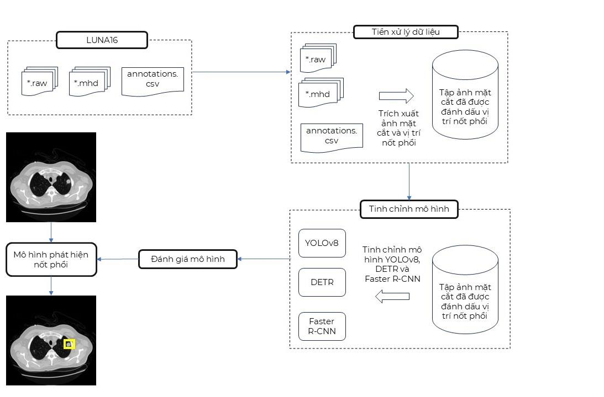
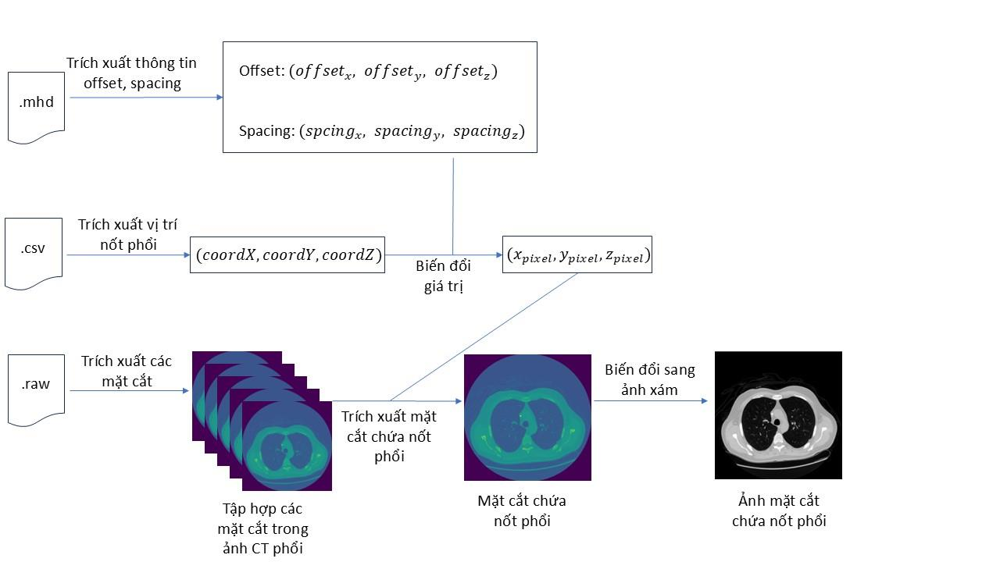
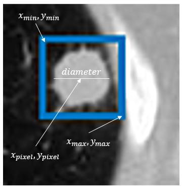

# Phát hiện nốt phổi trên ảnh CT phổi

Dự án cá nhân thực hiện trong khuôn khổ đồ án tốt nghiệp, mục đích là ứng dụng các mô hình phát hiện đối tượng vào bài toán phát hiện nốt phổi trên ảnh CT phổi.

## Quickstart

### Chạy demo với giao diện web

**Khuyến khích sử dụng GPU để tăng tốc độ phát hiện (hơn 10 phút đối với CPU)**

1. Cài đặt

```bash
# Clone repo
git clone https://github.com/Toshiiiii1/Abnormal_religions_detection_on_lung_CT_image.git

# Tải các thư viện Python cần thiết
pip install -r requirements.txt
```

2. Chạy backend (FastAPI)
```bash
# Di chuyển đến thư mục demo
cd demo/

# Khởi tạo database (lưu lịch sử phát hiện)
python models.py

# Di chuyển đến thư mục server và chạy backend
cd server/
uvicorn main:app --port 8000
```

3. Chạy frontend (ReactJS)
```bash
# Di chuyển đến thư mục frontend
cd demo/frontend/

# Tải các thư viện cần thiết
npm install

# Chạy frontend
npm run dev
```

### [Video demo](https://drive.google.com/file/d/1vbjmvar-hP2iIdj4G4l4DCJAoNS9rWrj/view?usp=drive_link)

## Tổng quan


## Thu thập dữ liệu

- LUNA16 là bộ dữ liệu ảnh CT phổi phục vụ huấn luyện và đánh giá mô hình phát hiện nốt phổi, được trích xuất từ cơ sở dữ liệu LIDC-IDRI.

- Gồm 888 ảnh CT có độ dày lát cắt < 3mm, kích thước mỗi mặt cắt là 512×512.

- Ảnh được lưu dưới định dạng MetaImage (mhd/raw):

    - .mhd: chứa thông tin mô tả ảnh.

    - .raw: chứa dữ liệu ảnh CT thực tế.

- Vị trí các nốt phổi ≥ 3mm được 4 bác sĩ chuyên khoa chú thích, lưu trong file annotations.csv.

- File annotations.csv chứa:

    - ID bệnh nhân

    - Tọa độ tâm nốt phổi (x, y, z) theo hệ tọa độ thế giới (mm)

    - Đường kính nốt phổi (mm)

- Tổng cộng có 1.186 nốt phổi được chú thích.

## Tiền xử lý dữ liệu

### Xác định lát cắt chứa nốt phổi

- Trích xuất thông tin về vị trí gốc tọa độ (offset) và khoảng cách giữa các điểm ảnh (spacing) từ tệp .mhd với thư viện SimpleITK.
- Trích xuất các mặt cắt của ảnh CT từ tệp .raw với thư viện SimpleITK.
- Trích xuất tọa độ tâm x, y, z của nốt phổi từ tệp annotations.csv, biến đổi tọa độ tâm từ hệ tọa độ thế giới (mm) sang hệ tọa độ điểm ảnh (pixel).

$$
\begin{align}
x_{\text{pixel}} = \frac{\text{coord_X} - \text{offset_x}}{\text{spacing_x}} \\
\end{align}
$$

- $z_{\text{pixel}}$ chính là vị trí mặt cắt mà nốt phổi được đánh dấu
- Trích xuất mặt cắt thứ $z_{\text{pixel}}$ từ tập hợp các mặt cắt, chuyển ảnh về ảnh xám bằng cách chuẩn hóa các giá trị Hounsfield về khoảng giá trị từ 0 đến 1 bằng phương pháp chuẩn hóa Min-Max với giá trị Min là -1.000 và giá trị Max là 400.



### Xác định bounding box được đánh dấu của nốt phổi

- Xác định đường kính của nốt phổi ở hệ tọa độ điểm ảnh (pixel)

$$
\begin{align}
x_{\min} &= x_{\text{pixel}} - \frac{\text{diameter}}{2} - 2 \\
x_{\max} &= x_{\text{pixel}} + \frac{\text{diameter}}{2} + 2 \\
y_{\min} &= y_{\text{pixel}} - \frac{\text{diameter}}{2} - 2 \\
y_{\max} &= y_{\text{pixel}} + \frac{\text{diameter}}{2} + 2
\end{align}
$$



### Lọc dữ liệu và tăng cường dữ liệu

- Loại bỏ ảnh có tọa độ bounding box có giá trị âm.
- 1.186 ảnh + tọa độ giảm xuống còn 1.152 + tọa độ.
- Mỗi ảnh được lưu ở định dạng .png.
- Các tọa độ bounding box lưu trong file .csv (ROI_coor4.csv)
- Dữ liệu sẽ được chia làm 3 tập bao gồm tập dữ liệu huấn luyện (70%), tập dữ liệu xác thực (10%) và tập dữ liệu kiểm tra (20%).
- Áp dụng tăng cường dữ liệu cho tập dữ liệu huấn luyện:
    - Lật ngang ảnh
    - Xoay ảnh 90 độ theo chiều kim đồng hồ
    - Xoay ảnh 90 độ ngược chiều kim đồng hồ
    - Xoay ngược ảnh
    - Xoay ảnh ngẫu nhiên trong khoảng từ -15 độ đến 15 độ

|  Tập dữ liệu  | Tổng số ảnh |
|-----|-------|
| Train set    | 2.417  |
| Val set | 117  |
| Test set | 228  |

## Fine-tune các mô hình phát hiện đối tượng

Siêu tham số fine-tune:

| Mô hình | Optimizer | Learning rate | Batch size | Image size | Epoch | Weight decay |
|----------------|-----------|----------------|-------------|-------------|--------|----------------|
| YOLOv8x          | AdamW     | 2e-3           | 8           | 512x512     | 50     | 5e-4           |
| DETR-ResNet50          |     AdamW      |        5e-5        |      8       |       512x512      |    50    |        5e-4        |
| Faster R-CNN ResNet-50          |     SGD      |        5e-3        |       8      |     512x512        |    10    |       5e-4         |


## Kết quả

Đánh giá mỗi mô hình với độ chính xác mAP50, mAPsmall và số lượng bỏ xót với tập dữ liệu kiểm tra.

|  Mô hình  | mAP50 | mAPsmall | Số lượng nốt phổi bỏ sót |
|-----|-------|-------|-------|
| YOLOv8x   | 81,8%  | 44,1%  | 64/228  |
| DETR-ResNet50 | 83,8%  | 44,2%  | 17/228  |
| Faster R-CNN ResNet-50 | **85,6%**  | **50,6%**  | **9/228**  |

## Hạn chế

1. Dự đoán quá nhiều vị trí dư thừa do nhầm lẫn giữa các vị trí có hình tròn hoặc hình bầu dục giống với nốt phổi.


2. Bỏ sót những nốt phổi nhỏ hoặc rất nhỏ.


3. Bỏ sót những nốt phổi có hình dạng đặc biệt (kính mờ, hang,...)


## Tham khảo

[1] [YOLOv8](https://docs.ultralytics.com/vi/models/yolov8/#overview)

[2] [DETR Github repo](https://github.com/facebookresearch/detr)

[3] [Faster R-CNN ResNet50](https://pytorch.org/vision/main/models/generated/torchvision.models.detection.fasterrcnn_resnet50_fpn.html)
